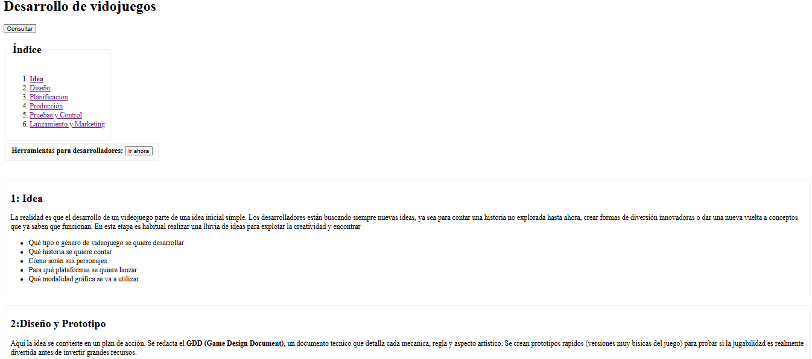
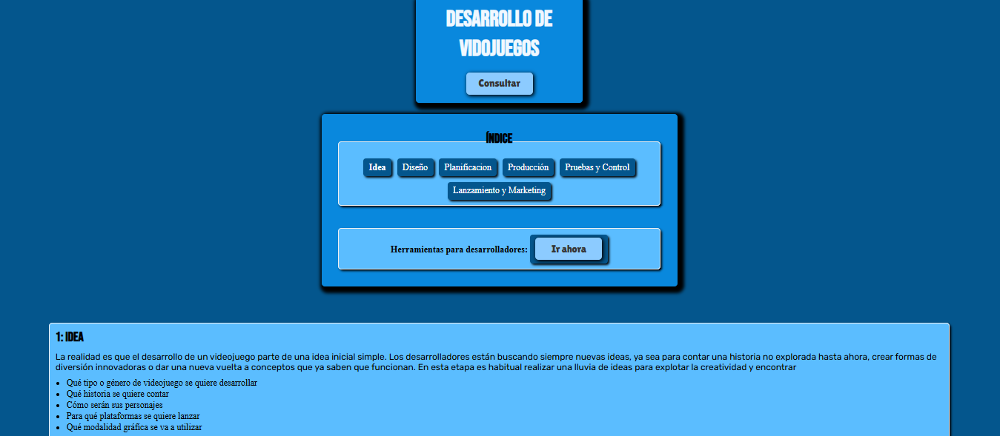
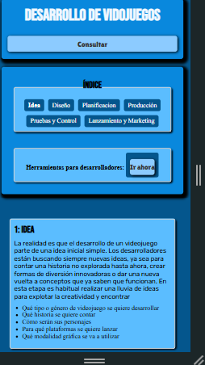

# Desarrollo de Videojuego

## Descripcion
Este proyecto consiste en una pagina web estatica desarrollada con HTML y CSS. El objetivo es mostrar informacion sobre el desarrollo de videojuegos, incorporando imagenes, videos y un formulario de contacto. No se utilizo JavaScript, por lo que toda la estructura y el diseño fueron realizados con HTML y CSS.

## La pagina incluye
- Encabezado principal.
- Sistema de navegacion mediante enlaces internos.
- Formulario de consultas organizado con tablas y fieldsets.
- Imagenes y videos relacionados con el desarrollo de videojuegos.
- Tabla con herramientas basicas que debe conocer un desarrollador indie.
- Diseño adaptable para distintos dispositivos.

## Contenido
- Pagina principal.
- Imagenes.
- Videos.
- Formulario.
- Tablas

## Capturas del proyecto
### Sin estilos CSS

### Con estilos CSS

### Vista responsive

---

## Tecnologias utilizadas

- HTML5
- CSS3
- Google Fonts
- Flexbox
- CSS Grid
- Media Queries
- Variables CSS

---

## Mejoras visuales incorporadas

- Se agrego una paleta de colores en tonos azules para darle una mejor apariencia al sitio.
- Se utilizaron distintas tipografias para diferenciar titulos, botones y textos obtenidas de Google fonts.
- Se incorporaron sombras en contenedores, imagenes y botones para mejorar la presentacion visual.
- Se añadieron efectos hover en botones y enlaces para que la navegacion sea mas interactiva.
- Se aplicaron transiciones suaves en algunos elementos de la pagina.
- Se implemento diseño responsive para que el contenido pueda verse correctamente en pantallas mas pequeñas.
- Se utilizaron bordes redondeados en distintos componentes para lograr una estetica mas agradable.

---

## Autor

Gimenez Lautaro Andres